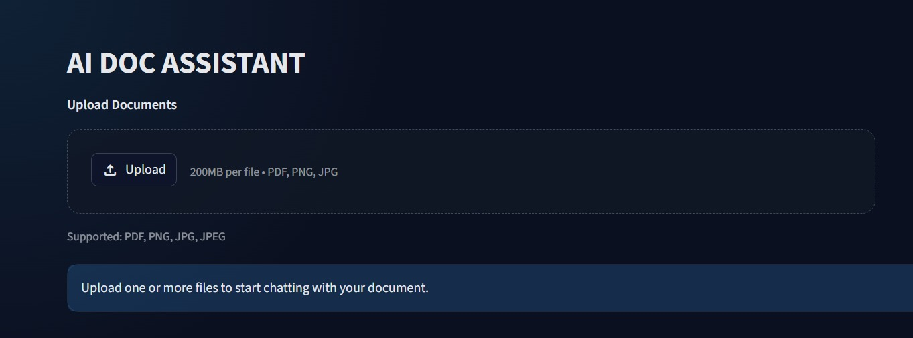
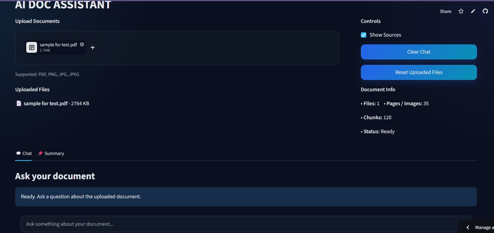
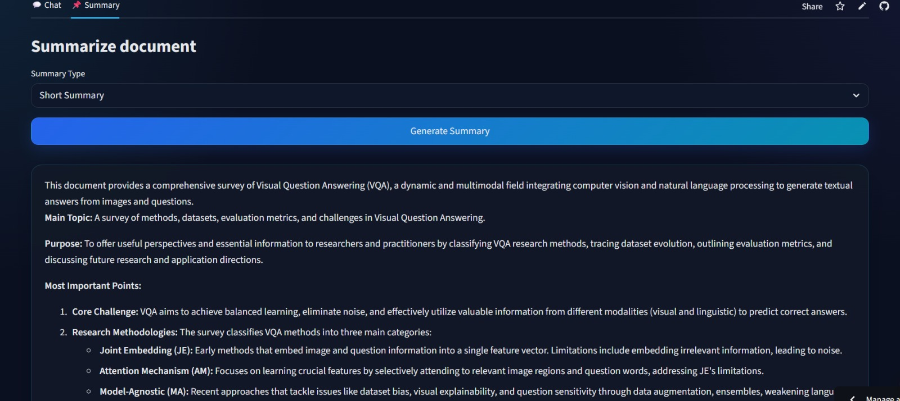
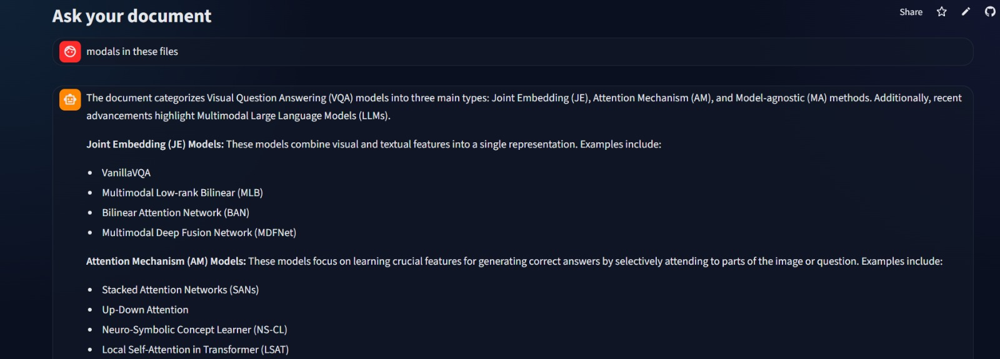

# AI Document Assistant

[Live Preview](https://ai-doc-assistant-prakhar.streamlit.app)

AI Document Assistant is a deployed Streamlit-based document intelligence application that helps users interact with PDFs and images through document-grounded question answering and summarization.

The application supports multi-file uploads, chat history recall, short/detailed/bullet summaries, evidence-backed responses, and summary download. It uses Gemini Document Understanding as the AI model layer, while the application manages the complete workflow around file handling, document preprocessing support, prompt orchestration, response formatting, evidence display, and deployment.

---

## Screenshots

### Upload Screen


### Document Workspace


### Summary Generation


### Document Question Answering


---

## Features

- Upload and process PDF, PNG, JPG, and JPEG files
- Multi-file document workspace
- Document-grounded question answering
- Chat history recall for follow-up questions
- Short, detailed, and bullet summary modes
- Evidence/source display for generated responses
- Summary download support
- Local document preview and document information display
- Dark-themed Streamlit interface
- Deployment-ready API key handling using Streamlit secrets

---

## Tech Stack

### Frontend and Application Framework

- Python
- Streamlit

### AI Model Layer

- Gemini Document Understanding
- Google GenAI SDK

### Document Processing

- pypdf
- pdfplumber
- Pillow
- pytesseract

### Utility and Data Handling

- NumPy
- Custom chunking logic
- Document cache handling
- Chat history management

### Deployment and Version Control

- Git
- GitHub
- Streamlit Cloud
- Streamlit Secrets

---

## Architecture

```text
User uploads PDF/Image
        ↓
Streamlit file manager
        - Validates supported file types
        - Handles multi-file uploads
        - Maintains uploaded document state
        ↓
Document preprocessing layer
        - Extracts basic text and metadata where possible
        - Supports PDF and image inputs
        - Uses OCR fallback for image-based content
        - Creates document chunks for internal handling
        ↓
AI orchestration layer
        - Builds task-specific prompts
        - Handles Q&A, summaries, and follow-up questions
        - Uses chat history for contextual continuity
        - Sends document context to Gemini Document Understanding
        ↓
Response generation
        - Produces document-grounded answers
        - Generates short, detailed, and bullet summaries
        - Formats responses for readability
        ↓
Evidence and UI layer
        - Displays generated answer
        - Shows supporting evidence/sources
        - Displays uploaded file information
        - Allows summary download
